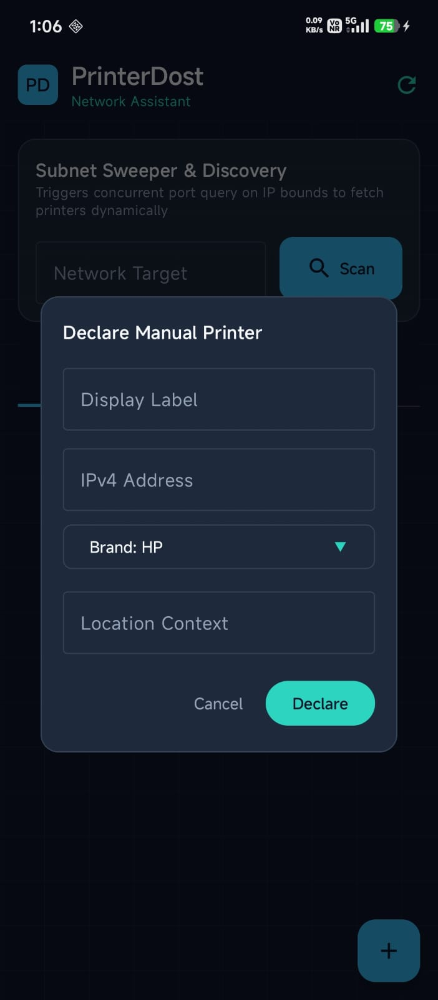
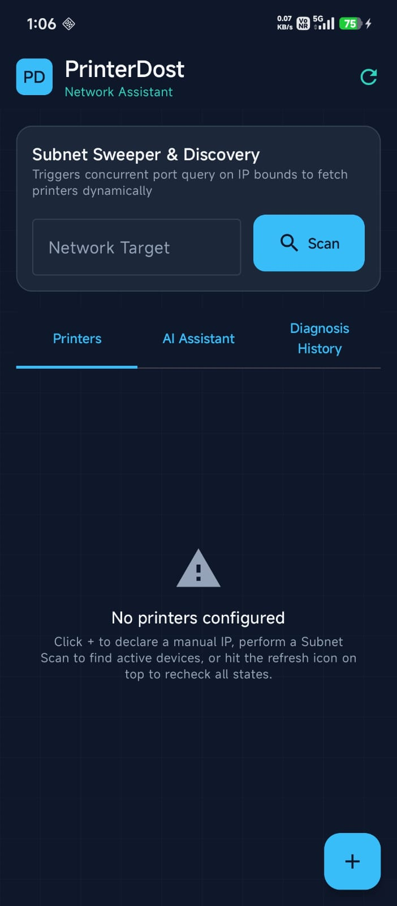

# PrinterDost

PrinterDost is an Android-based network printer discovery and troubleshooting application designed to help IT support professionals quickly identify, diagnose, and manage printers within local network environments.

<p align="center">
  
  
</p>

## Overview

PrinterDost was developed as a practical IT support utility to simplify common printer troubleshooting tasks. The application enables users to discover printers on the local network, monitor printer status, access printer management interfaces, and receive troubleshooting assistance from a mobile device.

## Features

- 🔍 Network printer discovery
- 🌐 Local subnet scanning
- 🖨 Printer status monitoring
- ⚙ Quick access to printer web management portals
- 🤖 AI-assisted troubleshooting support
- 📡 Network connectivity validation
- 📱 Mobile-friendly troubleshooting workflow
- 🎯 Designed for IT support and office environments


## Technology Stack

- Kotlin
- Android Studio
- Material Design 3
- Android Networking APIs
- Google Gemini API
- Gradle Kotlin DSL

## Use Cases

### IT Support Engineers

- Quickly locate printers on office networks
- Access printer management portals
- Verify printer availability and connectivity

### Desktop Support Teams

- Reduce printer troubleshooting time
- Identify network printer issues
- Simplify support operations

### Office Administrators

- Monitor printer accessibility
- Access printer interfaces from mobile devices
- Assist users with common printing issues

## Installation

### Prerequisites

- Android Studio (Latest Stable Version)
- Android SDK
- Gemini API Key (Required for AI features)

### Setup

1. Clone the repository:

```bash
git clone https://github.com/YOUR_USERNAME/PrinterDost.git
```

2. Open the project in Android Studio.

3. Allow Gradle synchronization to complete.

4. Create a `.env` file in the project root directory.

5. Add your Gemini API key:

```env
GEMINI_API_KEY=your_api_key_here
```

Refer to `.env.example` for the required format.

6. Build and run the application on:

- Android Emulator
- Physical Android Device

## Project Structure

```text
PrinterDost/
│
├── app/
├── screenshots/
│   ├── home.jpg
│   └── scan.jpg
├── .env.example
├── README.md
├── build.gradle.kts
├── settings.gradle.kts
└── gradle.properties
```

## Future Enhancements

- Multi-printer dashboard
- Advanced printer diagnostics
- Exportable troubleshooting reports
- Printer health monitoring
- Enhanced AI troubleshooting recommendations
- Additional printer vendor integrations

## Developer

**Sagar Saini**

IT Support Engineer | Microsoft 365 | Desktop Support | System Administration

### Skills

- Microsoft 365
- Windows Administration
- Desktop Support
- Active Directory
- Google Workspace
- Networking
- Printer Troubleshooting
- Technical Support

LinkedIn:
https://linkedin.com/in/sagarsainiknp

GitHub:
https://github.com/Sagarrishab

## License

This project is available for educational, portfolio, and demonstration purposes.

---

⭐ If you find this project useful, consider starring the repository.
